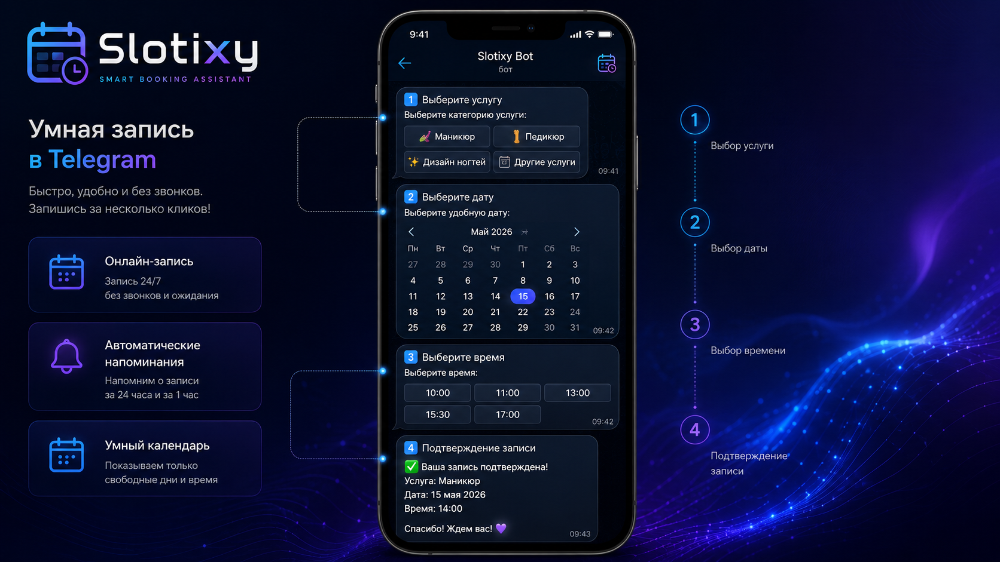
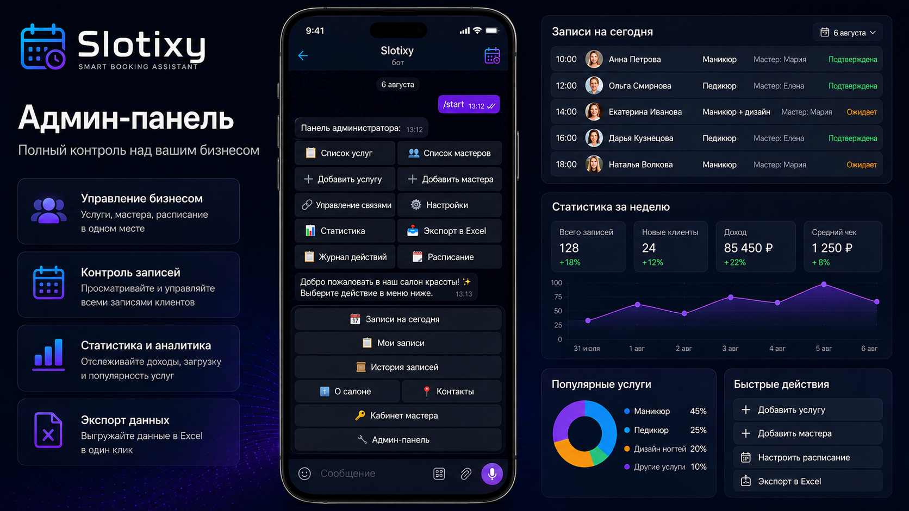

<div align="center">


# Slotixy

### Smart Booking Assistant

Современная система автоматизации записи клиентов в Telegram.


</div>

---

# 🚀 Что умеет Slotixy

Полностью автоматизирует запись клиентов для сферы услуг.

Подходит для:

- 💅 Маникюр
- 💇 Парикмахерские
- 💈 Барбершопы
- 💆 Массаж
- 🏥 Косметология
- 🐕 Груминг
- 🦷 Стоматология
- 🏋️ Персональные тренеры
- 📚 Репетиторы

---

# 👤 Возможности клиента

- Онлайн-запись
- Выбор услуги
- Календарь
- Выбор времени
- История записей
- Перенос записи
- Отмена записи
- Автоматические напоминания

---

# 👨‍💼 Возможности администратора

- Управление услугами
- Управление мастерами
- Рабочее расписание
- Статистика
- Выручка
- Журнал действий
- Экспорт Excel

---

# 👨‍🔧 Возможности мастера

- Личный кабинет
- Рабочий календарь
- Записи
- Контакты клиентов

---

# ⚙ Технологии

- Python 3.12
- AsyncIO
- Aiogram 3
- SQLAlchemy
- SQLite
- PostgreSQL
- APScheduler
- OpenPyXL

---

# 🏗 Архитектура

```
handlers/
database/
services/
middlewares/
filters/
keyboards/
utils/
```

---

# 📸 Интерфейс

### Главное меню



---

### Админ-панель



---

### Статистика


---

### Календарь


---

# ✨ Основные преимущества

✅ полностью асинхронная архитектура

✅ высокая скорость работы

✅ защита от двойной записи

✅ удобный интерфейс

✅ автоматические уведомления

✅ экспорт Excel

✅ роли пользователей

---

# 🔥 Roadmap

- 🤖 AI-ассистент
- 💳 Онлайн-оплата
- 🌐 Web Dashboard
- ☁ Облачная версия
- 📱 Мобильное приложение

---

# 📄 License

Private Commercial Project
